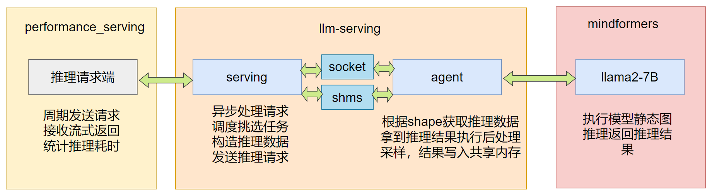
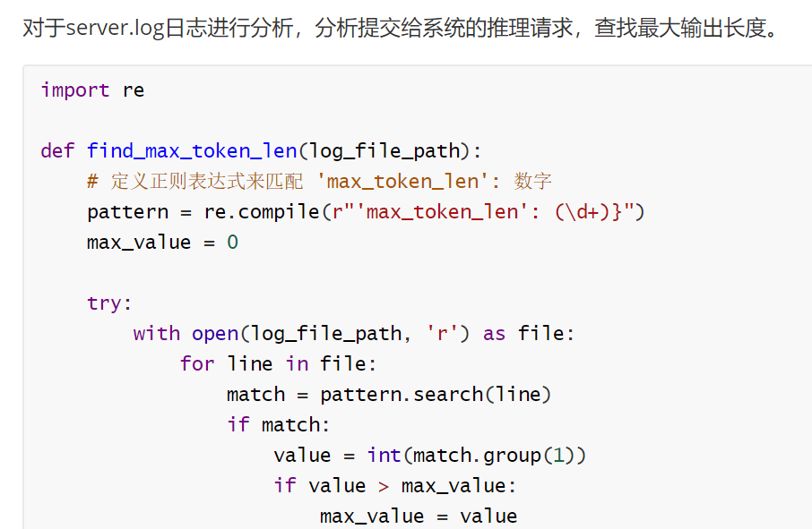
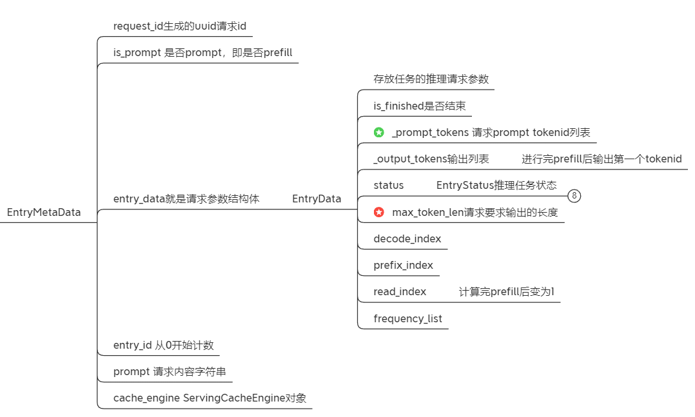

# 🏆 华为昇思挑战赛-大模型推理调优赛道金奖方案

**获奖排名**：Top 1 金奖获得者 美滋滋学编程 ￥110000| **参赛时间**：2024年6月-2024年12月

**技术领域**：大模型推理优化 · 服务端调度 · 模型量化压缩 · 高性能计算

## 📌 项目背景
本项目为2024年华为昇思MindSpore模型开发挑战赛推理调优赛题的金奖作品，针对大语言模型服务端推理场景，基于MindSpore框架实现了从模型优化到部署落地的完整推理加速方案。通过系统级的性能调优，在保证模型精度的前提下，**推理速度相比baseline提升27倍**，最终以**完成全部推理请求耗时最短**获得赛道最高奖项。

**比赛官网**：[昇思MindSpore模型开发挑战赛【推理调优赛题】](https://www.hiascend.com/developer/contests/details/c40cacdb4fa347bd8b378ad881e1e80e?module=52d78eec65a74fc8b9688a750a6b9d0f)  

**获奖公示**：[获奖名单公示](https://www.hiascend.com/developer/contests/details/c40cacdb4fa347bd8b378ad881e1e80e?module=c182bd74e8054da3b3f2aadf0bd247d2)


## 🔍推理调优赛题介绍与分析

在Ascend 910b 32G|ARM:24核 192GB上使用performance_serving程序按照固定时间间隔发送1500条推理请求给llm-servring程序，记录完成推理总耗时，总耗时要求低于600秒，并且需要完整的前后处理推理过程和logits精度损失不超过千分之五。

### 整体关系分析



整体关系如上图所示。

接下来我们分析一下baseline中采用的优化策略和支持哪些优化算法。掌握这些内容可以更好的帮助我们明确开发优化基础，知道哪些优化已经完成，哪些优化已经实现但还是需要调整最佳参数才能发挥最大作用，还有哪些优化是暂时还没有实现的。

### Baseline策略分析

baseline已经具备的一些优化算法实现梳理：

mindformer推理后端：

* InferAttention使用了Flashattention算法
* ROPE采用了预先计算，存入cache操作，推理过程中直接取值，减少计算量
* 静态图，加快推理速度

* 支持Pagedattention算法，KVcache的存放更加灵活

llm-serving服务调度端：

* Fastapi异步处理http推理请求
* decoding阶段多batch推理，但是不支持prefill阶段batchsize推理。
* Continuous batching，每次迭代推理后重新调度组batch，可以大幅提升LLM服务的吞吐量。

baseline选择最直接的推理方式，prefill和decoding阶段的batchsize都是1，即每次推理只能调用的推理请求只能完成一个推理请求的一个token输出。所有的请求需要1500条请求的输出token总数次推理调用，才能完成全部的推理任务，所以整体的耗时会很长。

### 解题思路优化策略盘点与可行性分析

* 模型本身，后处理与模型处理融合，减少模型推理输入数据量，直接将后处理与模型推理融合，得到最终结果。
* 推理后端，采用一些flashattention、pagedattention等用法，静态图推理
* 服务调度，多batch推理、任务优先级

首先看量化策略分析，说到推理加速，很多同学可能会想到对模型进行量化，从而实现加速推理，那么我们来看一下量化策略的可行性分析。

#### **量化策略分析：**

**weight only量化方式**：GPTQ、AWQ等算法，只能减少模型加载时间，推理过程中权重需要反量化，但是实际计算仍然是fp16类型，并且反量化的计算与batchsize有关系，只能减少内存占用，并不能加快推理速度，不适合服务端推理。

**矩阵乘法量化**：将linear权重和激活值都进行int8量化，Gemm的实现替换为int8实现，事先对权重进行量化，激活值前后要插入量化与反量化算子，会加快推理速度，适合用在服务端，但是可能导致精度损失超标。

**KVcache量化**：将KVcache进行量化，由FP16量化为int8储存，进行计算时，再反量化到fp16，适用于显存空间受限的服务端，可以加倍提升用户承载量。不适合我们当前的场景，我们的推理请求相对来说不长，并且使用了pagedattention进行管理KVcache，目的是快速完成推理而不是增加服务中同时承载的用户数。

所以量化策略直接pass掉，这部分的优化先不去考虑。

#### **接下来考虑模型推理速度的优化**：

* FlashAtention算法、PA算法、RMSNorm、ROPE算子、静态图推理都已经高效实现在mindformer中

* 采样阶段的贪婪搜索后处理优化，值得去做

* warmup预热推理引擎。

* qkv ffn linear 合并计算

真正能带来处理效率的策略基本上都是服务调度相关的内容，优秀的调度batch策略相比传统的静态batch策略提升达到好几十倍。

#### **服务调度优化**：

* batchsize的prefill推理

* 根据数据集调整seq_len长度

* 调整请求任务优先级

* 完整的Continuous batching包括两个主要部分，一个是以单个token生成为step进行batching策略，另一个点就是ORCA策略。llm-serving实现的continute batching策略，只实现了第一个点，而没有实现第二个点。

以上就是我的解题思路，确定好要做的优化策略，然后就去实践。

## 🛠️优化feature实现

### ⭐️prefill阶段batchsize推理

根据上面的分析，在调度完成后从running list挑选任务的时候，对prefill阶段任务的选择开始，在此处完成适配prefill多batch的开发工作。

开发完成-增加推理服务吞吐量，在llmserving的基础上，原先只支持decoding的batchsize推理，现在完善了多batch的prefill阶段的推理，大幅提升推理吞吐量。

### ⭐️后处理与模型推理融合

将模型的logits输出，直接进行argmax计算，而不是将logits传出，然后再传入进行计算，大大增加了效率。避免将batchsize，vocab_size的数据搬运出去，而是直接将后处理实现在模型推理过程中，将后处理与模型推理融合一起用静态图推理完成。

```python
修改/home/ma-user/work/mindformers/mindformers/models/llama/llama.py 代码，在LlamaForCausalLM forward函数上补充贪婪搜索策略逻辑
        logits = self.cast(logits, mstype.float32)
        indices, max_values = self.argmax_with_value(logits)# 计算每行的最大值和对应的索引
        indices = P.Cast()(indices, mstype.int32)
        if not self.training:
            return indices, max_values
```

得到的结果就是词表的索引和对应的值，所以可以直接将结果写入到共享内存中，而不需要再次进行计算。

```python
    def handle_inference_results(self,outputs, outputs_shm, output_logprob_shm, decode_index, prefill=True):
        # self.targets.clear()
        indices=outputs[0]
        max_values=outputs[1]
        # 记录索引和对应的最大值日志
        logging.info("handle_inference_results indices type is {}, value is {}".format(indices.dtype, indices))
        logging.info("handle_inference_results max_values type is {}, value is {}".format(max_values.dtype, max_values))
        indices=indices.asnumpy().reshape(-1)
        max_values=max_values.asnumpy().reshape(-1)
        # 当 rank_id 为 0 时，将数据写入共享内存
        if self.rank_id == 0:
            if prefill:
                for index in decode_index:
                    tmp = np.ndarray((index + self.current_batch_size,), dtype=indices.dtype, buffer=outputs_shm.buf)
                    tmp[index: index + self.current_batch_size] = indices[:]


                    tmp_logprob = np.ndarray((index + self.current_batch_size,), dtype=np.float64,
                                             buffer=output_logprob_shm.buf)
                    tmp_logprob[index: index + self.current_batch_size] = max_values[:]

            else:
                # 非预填充模式
                tmp = np.ndarray((self.current_batch_size,), dtype=indices.dtype, buffer=outputs_shm.buf)
                tmp[:] = indices[:]
                # 将对应的最大值写入共享内存
                tmp_logprob = np.ndarray((self.current_batch_size,), dtype=np.float64, buffer=output_logprob_shm.buf)
                tmp_logprob[:] = max_values[:]

```


### ⭐️根据数据集调整seq_len

我在一阶段开源的报告中就通过分析数据集，获取到了最长的token句子，找到最佳的seq_len长度的配置，根据不同的batchsize情况动态调整seq_len长度，可以减少推理过程中无用的填充长度，增加推理速度。



测速数据集的最大输出长度为504，精度数据集最大的输出长度为464.

### ⭐️任务优先级调度

最常见的任务调度策略是FCFS策略，就是说谁先到，先服务谁，也就是按照时间顺序排序。除了时间顺序，我们可以观察一下任务队列中的结构体，看可以选择哪些变量作为优先级的选择依据。



可以看出，大多数都是推理任务的运行状态记录，可以作为优先级选择的一个是prompt长度，另一个是maxTokenLen请求要求输出的长度。

在训练场景中，我们通常选择prompt长度接近的几个输入组成batch进行训练这样可以减少padding填充量，但是在推理端通常采用的是FCFS策略，所以会将几个输入直接组成batch，然后padding到指定长度进行推理。既然要padding，其实根据请求长度安排优先级意义并不大。

然后再看另一个maxTokenLen请求要求输出的长度，本次比赛中，推理请求的输出token个数是已知的，那么就可以根据输出请求的token数量大小，给这些推理任务设置不同的优先级。既然已经知道推理的token数，那么我们就可以优先完成那些token生成数比较多的请求的prefill阶段，那么在后续batchsize为128的decoding请求中，有效的槽位才会更多，NPU的利用率也就非常大。

通过对比试验说明：在520seqlen句子长度下，将输入排序，优先处理输出少的请求时，要比无序状态快30秒，而优先处理长token的请求，要再次基础上再快20秒。

如果是在4096句子长度下，分别快40秒和65秒.

对比实验数据说明不同策略的推理次数差异，由于代金券用完了，所以没办法把这个对比实验重新跑一遍。


### ⭐️warmup预热推理引擎

在很多推理框架中，都会在进行推理服务前对推理进行warmup预热，比如FasterTransformer就会对模型进行一次推理预热，在vllm中，预热引擎会调用cuda graph对不同batchsize的输入进行预热，然后再去执行对应的推理任务。

通过查看日志，第一次调用推理引擎的时间通常会久一些，如果事先编写一个空白输入进行一次模拟的前向推理，有利于提升推理服务整体的效率。

通过对于mindformer的预先调用，减少第一次调用的额外耗时。

```python
    def warmup_and_multiPrefill(self,cfg:ServingConfig):
        batchsize = cfg['model_config']['prefill_batch_size'][0]
        seq_len = cfg['model_config']['seq_length'][0]
        input_ids = np.array([
        [1, 2, 3, 4, 5, 6, 7, 8] + [0] * (seq_len - 8)
        ] * batchsize, dtype=np.int64)
        valid_length_each_example = np.array([8] * batchsize, dtype=np.int64)
        current_index = np.array([7] * batchsize, dtype=np.int64)
        block_tables = np.array([
        [0] + [-1] * (256 - 1)
        for i in range(batchsize)
        ], dtype=np.int32)
        slot_mapping = np.array(list(range(10)) + [-1] * (seq_len*batchsize - 10), dtype=np.int32)
        model_kwargs = {"current_index": current_index}
        self.mindspore_model.is_first_iteration = True
        # self.mindspore_model.config.batch_size=4
        res, current_index = self.mindspore_model.forward(input_ids=input_ids,
                                                valid_length_each_example=valid_length_each_example,
                                                generation_config=self.mindspore_model.config,
                                                block_tables=block_tables,
                                                slot_mapping=slot_mapping,
                                                prefill=True,
                                                **model_kwargs)
```


### ⭐️针对qkv和ffn权重进行拼接，合并Gemm运算

对qkv的weight进行合并以后，只需要调用一次Gemm运算，就可以完成三个矩阵的运算，减少了Gemm运算调用的次数，ffn层的gate和up linear的拼接也是同理。

```
X (N, d_input)
├── W_Q (d_input, d_output) → Q (N, d_output)
├── W_K (d_input, d_output) → K (N, d_output)
└── W_V (d_input, d_output) → V (N, d_output)

X (N, d_input)
└── W_{QKV} (d_input, 3 * d_output) → X W_{QKV} (N, 3 * d_output)
                         └── split(3) → [Q, K, V] (N, d_output)
```

代码实现：

```python
        if self.qkv_concat:
            self.w = Linear(in_channels=self.hidden_size,
                            out_channels=self.hidden_size + self.kv_dim * 2,
                            has_bias=qkv_has_bias,
                            compute_dtype=compute_dtype,
                            param_init_type=param_init_type,
                            skip_redistribution=is_dynamic)
            self.w.shard(((dp, 1), (mp, 1)))
            
        if self.ffn_concat:
            self.w_gate_hidden = Linear(in_channels=dim,
                                        out_channels=hidden_dim * 2,
                                        expert_num=expert_num,
                                        outer_batch=dp_moe,
                                        has_bias=False,
                                        compute_dtype=compute_dtype,
                                        param_init_type=param_init_type,
                                        skip_redistribution=is_dynamic)
            self.activate = self.hidden_act()
            self.split = ms.ops.auto_generate.SplitWithSize()
            self.w2 = Linear(in_channels=hidden_dim,
                             out_channels=dim,
                             expert_num=expert_num,
                             outer_batch=dp_moe,
                             has_bias=False,
                             compute_dtype=compute_dtype,
                             param_init_type=param_init_type,
                             skip_redistribution=is_dynamic)
```

### ⭐️一些零碎的优化点和bug fix

#### 任务未能正常结束

```python
    /home/ma-user/work/llm-serving/mindspore_serving/server/llm_server_post.py
    async def _master_abort(self, request_ids):
        logging.debug(f"Master abort called with request_ids type: {type(request_ids)}, value: {request_ids}")
        # self.master.abort_request(request_ids)
        for request_id in request_ids:
            self.master.abort_request(request_id)
```

请求完成后，将传递给scheduler中的进行处理，设置为停止状态。

```python
    def abort_entry(self,
                    request_id: str):
        for index, data in enumerate(self.running_request_list):
            if data.request_id == request_id:
                self.running_request_list[index].get_entry_data().set_status(EntryStatus.FINISHED_STOPPED)
```

但是传递进来的是一个set对象，需要循环去调用。

没有及时将这些请求设置为完成状态，下一次调度推理就仍然会再次进行，那么就会导致已经推理完成的请求多推理一次，直到下一次超过生成token的限制时，设置对应的结束状态，才会被移除running队列。

#### 一些数据类型转换上的优化

数据精度的反复转换，程序中有很多数据类型上的转换。

例如

推理过程中`self.kbk_targets = np.full((decode_batch_size, seq_length), self.config.model_config.pad_token_id)`

初始化完是int64,应该是int32类型。input_ids第一次输入是int32类型的，在打平的时候，把数据格式由int32转为float64了，代码应该这么写。

```python
input_ids = np.concatenate((input_ids, np.zeros((input_ids.shape[0], seq_length - 1))), axis=1)

input_ids = np.concatenate((input_ids, np.zeros((input_ids.shape[0], seq_length - 1), dtype=np.int32)), axis=1)
```

类似问题很多，这些问题都会导致推理过程中的一些性能损耗，虽然这些性能消耗可能不算太大，但是我认为是没有必要的，并且在debug的过程中，看着一个变量的数据精度反复的变来变去，比如这个input_ids的数据类型本来应该是int32，但是在运行过程中一会儿变成int64一会儿变成fp64，在模型推理输入时又变为了最初数据精度。


#### RMSNorm的weight数据精度类型

在加载权重过程中，每次看到模型的权重设置的数据类型和文件的数据精度不一致打印warning日志，需要进行对应修改。

```python
class LlamaRMSNorm(nn.Cell):
    def __init__(self, dim, eps=1e-6, compute_type=mstype.float32):
        super(LlamaRMSNorm, self).__init__()
        self.eps = eps
        self.compute_type = compute_type
        self.weight = Parameter(initializer('ones', (dim,), dtype=mstype.float32), parallel_optimizer=False) #dtype=compute_type
```


#### 遍历有效任务

比如说在执行调度后，查看调度任务列表是否存在有效任务，有个遍历操作，遍历完所有任务然后统计有效任务个数，不为0，那就开始推理，不存在有效任务则直接返回。

```python
class AsyncMaster(Master):
    # Master 类的异步版本，支持异步处理推理任务。
    async def step_async(self) -> List[ResponseOutput]:
        # 调用调度器的 _schedule() 方法获取任务元数据列表 (entries_metadata_list) 和当前批次的大小 (current_batch_size)。
        entries_metadata_list, current_batch_size = self._schedule()
        valid_entry_len = 0
        # 检查每个生成任务的状态，统计处于 RUNNING 或 INPUT_OUTOFRANGE 状态的任务数量。
        for metadata in entries_metadata_list:
            # 推理还在进行或者提示词长度超出范围，这两个状态下的任务计入 valid_entry_len
            if metadata.entry_data.get_status() == EntryStatus.RUNNING or \
                    metadata.entry_data.get_status() == EntryStatus.INPUT_OUTOFRANGE:
                valid_entry_len += 1#那直接可以直接break嘛，没必要算出来多少个可以执行
        # 如果当前批次中没有有效的推理任务（即 valid_entry_len == 0），则返回 None，表示没有可处理的任务。
        if valid_entry_len == 0:
            return None
        # 异步调用 _run_workers_async 执行推理任务，并返回模型的推理结果。
        output = await self._run_workers_async(current_batch_size, entry_metadata_list=entries_metadata_list)
        return output
```

还有一些其他比较小的优化点就不再一一列举了。

## 💼总结

总结一下，主要是两大部分内容，一方面是解题思路优化策略盘点和可行性分析，分析了baseline已经具备的一些优化算法，列举了一些主流的推理策略，比如说量化策略可行性分析，比如 高效的算子实现、和服务调度策略优化分析。

另一方面就是针对本次比赛推理调优赛题所做的优化策略实现方案的说明。

